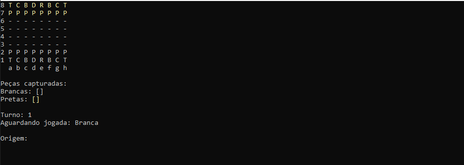
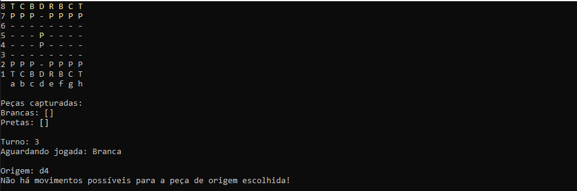
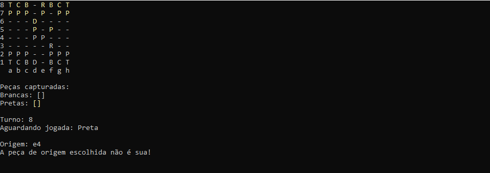
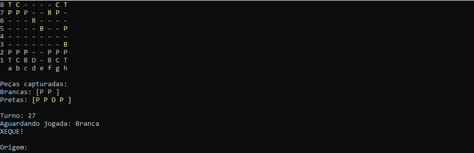
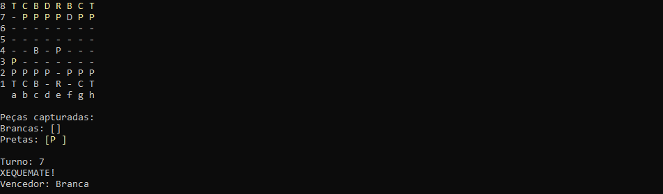

# Jogo de Xadrez - C#

#### Projeto iniciado no curso "C# Completo - Programação Orientada a Objetos + Projetos" do professor Nelio Alves com o propósito de aprendizado e maior prática.

#### A ideia principal foi projetar um tabuleiro de xadrez real no console, com o maior número de regras e jogadas especiais, sendo o objetivo deixar o mais semelhante possível a um tabuleiro real como mostram as imagens a seguir:

##

### Inicio do jogo:

### Primeiras movimentações:

### Mover peça conforme jogada descrita:

### Xeque realizado no jogo

### XequeMate realizado no jogo - Fim de jogo

